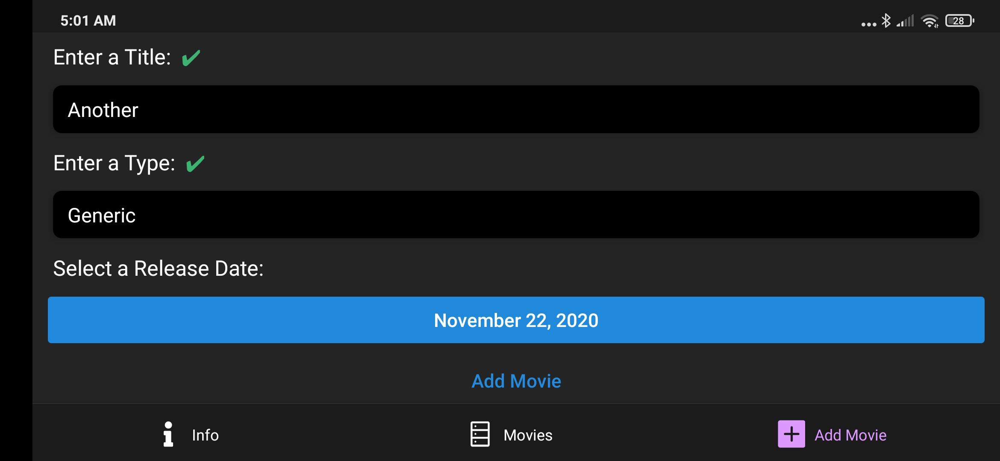

# Mobile Development

[Programming assignment 1] During the development process no problems were faced.

[Programming assignment 2] Description of Playground - Task 4 is slightly confusing

From task description: value is average of all students points(c)

But due to example of output You expect average of students' marks (`sumPoints` values).
Average point will be equal to ~10, calculated from `studentPoints` value.

P.S. I have done assignment accounting that I have to find avg mark(sum of points) per group (as in example)

[Programming assignment 3] During the development process no problems were faced.

[Programming assignment 4] During the development process no problems were faced.

Examples (quite a lot):

